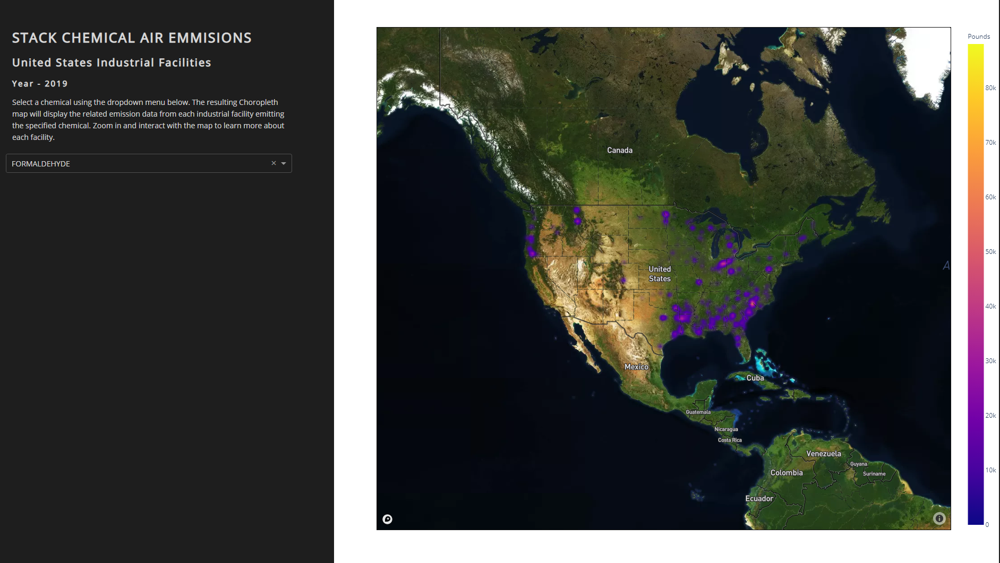

# Toxics-Release-Inventory - Work in Progress

## Objective 
 Analyze the release of chemical emissions from industrial facilities around the United States.

## Data
The dataset titled 'tri_2019_us.csv' was provided by the Enviromental Protection Agency. The data file documentation can be found [here](https://www.epa.gov/sites/production/files/2019-08/documents/basic_data_files_documentation_aug_2019_v2.pdf). 

## Progress
**Early Phase:**
Current state of project can be found at [chem-emission-dashboard-19214.herokuapp.com](https://chem-emission-dashboard-19214.herokuapp.com) . Screenshots are included below.

# To DO
* Format the map to fit full page on desktop
* Format for mobile
* Incorporate CAS number to pull the structure and toxicity data of each chemical.
* Create visualizations using chemical substance data pulled.